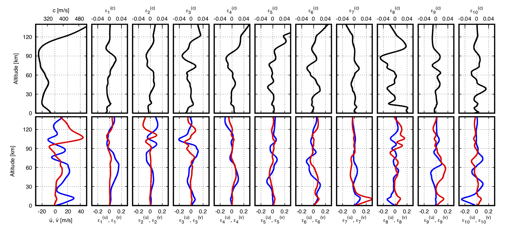

.. _eofs:

=======================================
Empirical Orthogonal Function Analysis
=======================================

* Empirical orthogonal functions (EOFs) are a mathematical tool useful for characterizing a suite of vectors or functions via construction of basis vectors or functions.
* Consider :math:`N` fields, :math:`a_n (\vec{z})`, sampled at :math:`M` points, :math:`z_m` that define a matrix,

.. math::
	A \left( \vec{z} \right) = 
    \begin{pmatrix}
    a_1 \left( z_1 \right) & a_2 \left( z_1 \right) 	& \cdots 	& a_N \left( z_1 \right) \\
    a_1 \left( z_2 \right) & a_2 \left( z_2 \right) 	& \cdots 	& a_N \left( z_2 \right) \\
    \vdots 				& \vdots					& \ddots	& \vdots 	 \\
    a_1 \left( z_M \right) & a_2 \left( z_M \right)	& \cdots 	& a_N \left( z_M \right)
    \end{pmatrix}
    
* Analysis of this :math:`N \times M` matrix to compute EOFs entails first extracting the mean set of values and then applying a singular value decomposition (SVD) to define singular values and orthogonal functions,

.. math::
    A \left( \vec{z} \right) 
    \, \xrightarrow{\text{SVD}} \, 
    \bar{a} \left( z_m \right), \mathcal{S}_n^{(a)}, \mathcal{E}_n^{(A)} \left( z_m \right)

* The resulting EOF information can be used to reproduce any other other field sampled on the same set of points,

.. math::
	\hat{b} \left( z_m \right) = \bar{a} \left( z_m \right) + \sum_n{ \mathcal{C}_n^{(b)} \mathcal{E}_n^{(A)} \left( z_m \right)},
	
   	\mathcal{C}_n^{(b)} = \sum_m{\mathcal{E}_n^{(A)} \left( z_m \right) \left( b \left( z_m \right) - \bar{a} \left( z_m \right) \right)},

* Note that the coefficients, :math:`\mathcal{C}_n^{(b)}`, are defined by the projection of the new function onto each EOF (accounting for the mean, :math:`\bar{a}`)

* Consider a second matrix, :math:`B\left( \vec{z} \right)` defined by a set of :math:`K` fields, :math:`b_k \left( \vec{z} \right)`.  Each of these columns produces a set of coefficients that can be used to define a distribution via a kernel density estimate (KDE),

.. math::
    \left\{ \mathcal{C}_n^{(b_1)},  \mathcal{C}_n^{(b_2)}, \ldots, \mathcal{C}_n^{(b_K)} \right\}
	\, \xrightarrow{\text{KDE}} \,
	\mathcal{P}_n^{(B)} \left( \mathcal{C} \right).

* Comparison of the distributions for various matrices, :math:`B_1, B_2, B_3, \ldots`, allows one to define the relative similarity between differen sets by computing the overlap and weighting each term by the EOF singular values,

.. math::
	 \Gamma_{j,k}  =  \sum_n{ \mathcal{S}_n^{(\text{all})} \int{\mathcal{P}_n^{(B_j)} \left( \mathcal{C} \right) \mathcal{P}_n^{(B_k)} \left( \mathcal{C} \right) d \mathcal{C} }}

* In the case of EOF analysis for atmospheric seasonality and variability, each :math:`a_m(\vec{z})` is an atmospheric specification sampled at a set of altitudes, :math:`\vec{z}`, and the set of atmospheric states in :math:`A` includes all possible states for the entire year (and potentially multiple years).  The sets of atmospheres in each matrix, :math:`B_j`, is a subset of :math:`A` corresponding to a specific month or other interval.  The coefficient overlap can be computed for all combinations to identify seasonality and determine the grouping of intervals for which propagation effects will be similar.

************************
EOF methods in stochprop
************************
* Empirical Orthogonal Function analysis methods can be accessed by importing :code:`stochprop.eofs`
* Although analysis can be completed using any set of user defined paths, it is recommended to build a set of directories to hold the eof results, coefficient analyses, and samples produced from seasonal analysis.  It is often the case that the transitions from summer to winter and winter to summer are overly similar and can be grouped together so that only 3 season definitions are needed.  This pre-analysis set up can be completed manually or by running:

.. code-block:: python

	import os
	import subprocess
	import numpy as np

	from stochprop import eofs

	if __name__ == '__main__':
		eof_dirs = ["eofs", "coeffs", "samples"]
		season_labels = ["winter", "spring", "summer"]

		for dir in eof_dirs:
			if not os.path.isdir(dir):
				subprocess.call("mkdir " + dir, shell=True)

		for season in season_labels:
			if not os.path.isdir("samples/" + season):
				subprocess.call("mkdir samples/" + season, shell=True)

------------------------------
Load Atmosphere Specifications
------------------------------

* Atmospheric specifications are available through a number of repositories including the Ground-to-Space (G2S) system, the European Centre for Medium-Range Weather Forecasts (ECMWF), and other sources
* A convenient source for G2S specifications is the University of Mississippi's National Center for Physical Acoustics (NCPA) G2S server at http://g2s.ncpa.olemiss.edu
* The current implementation of EOF methods in stochprop assumes the ingested specifications are formatted such that the columns contain altitude, temperature, zonal winds, meridional winds, density, pressure (that is, :code:`zTuvdp` in the infraGA/GeoAc profile options), which is the default output format of the G2S server at NCPA.  Note: a script is included in the infraGA/GeoAc methods to extract profiles in this format from ECMWF netCDF files.
* The atmosphere matrix, :math:`A(\vec{z})` can be constructed using :code:`stochprop.eofs.build_atmo_matrix` which accepts the path where specifications are located and a pattern to identify which files to ingest.

	- All specification in a directory can be ingested for analysis by simpy using,

	.. code-block:: python

		A, z0 = eofs.build_atmo_matrix("profs/", "*.dat")

	- Alternately, specific months, weeks of the year, years, or hours can be defined to limit what information is included in the atmospheric matrix, :math:`A(\vec{z})`,

	.. code-block:: python

		A, z0 = eofs.build_atmo_matrix("profs/", "*.dat", months=['10', '11', '12', '01', '02', '03'])
		A, z0 = eofs.build_atmo_matrix("profs/", "*.dat", weeks=['01', '02'])
		A, z0 = eofs.build_atmo_matrix("profs/", "*.dat", years=['2010'])
		A, z0 = eofs.build_atmo_matrix("profs/", "*.dat", hours=['18'])

--------------
Computing EOFs
--------------

* Once the atmosphere matrix, :math:`A(\vec{z})`, has been ingested, EOF analysis can be completed using:

.. code-block:: python

	eofs.compute_eofs(A, z0, "eofs/examples")

* The analysis results are written into files with prefix specified in the function call ("eofs/examples" in this case).  The contents of the files are summarized is the below table.

+--------------------------------------+-------------------------------------------------------------------------------------------+
| EOF Output File                      | Description                                                                               |
+======================================+===========================================================================================+
| eofs/example-mean_atmo.dat           | Mean values, :math:`\bar{a} \left( \vec{z} \right)` in the above discussion               |
+--------------------------------------+-------------------------------------------------------------------------------------------+
| eofs/example-singular_values.dat     | Singular values corresponding each EOF index                                              |
+--------------------------------------+-------------------------------------------------------------------------------------------+
| eofs/example-adiabatic_snd_spd.eofs  | EOFs for the adiabatic sound speed, :math:`c_\text{ad} = \sqrt{ \gamma \frac{p}{\rho}}`   |
+--------------------------------------+-------------------------------------------------------------------------------------------+
| eofs/example-ideal_gas_snd_spd.eofs  | EOFs for the ideal gas sound speed, :math:`c_\text{ad} = \sqrt{ \gamma R T}`              |
+--------------------------------------+-------------------------------------------------------------------------------------------+
| eofs/example-merid_winds.eofs        | EOFs for the meridional (north/south) winds                                               |
+--------------------------------------+-------------------------------------------------------------------------------------------+
| eofs/example-zonal_winds.eofs        | EOFs for the zonal (east/west) winds                                                      |
+--------------------------------------+-------------------------------------------------------------------------------------------+

* The EOF file formats is such that the first column contains the altitude points, :math:`\vec{z}`, and each subsequent column contains the :math:`n^{th}` EOF, :math:`\mathcal{E}_n^{(A)} \left( \vec{z} \right)`

* As discussed in Waxler et al. (2020), the EOFs are computed using stacked wind and sound speed values to conserve coupling between the different atmospheric parameters and maintain consistent units (velocity) in the EOF coefficients
    
* The resulting EOFs can be used for a number of analyses including atmospheric updating, seasonal studies, perturbation analysis, and similar analyses

    
    Mean atmospheric states (left) and the first 10 EOFs for the adiabatic sound speed (upper row) and zonal and meridional winds (lower row, blue and red, respectively) for analysis of the atmosphere in the northeastern US

----------------------------------------------
Compute Coefficients and Determine Seasonality
----------------------------------------------
* Using the EOFs for the entire calendar year, coefficient sets can be defined for individual months (or other sub-intervals) using the :code:`stochprop.eofs.compute_coeffs` function.

* For identification of seasonality by month, the coefficient sets are first computed for each individual month using:

.. code-block:: python

    coeffs = [0] * 12
    for m in range(12):
        Am, zm = eofs.build_atmo_matrix("profs/", *.dat", months = ['%02d' % (m + 1)])
        coeffs[m] = eofs.compute_coeffs(Am, zm, "eofs/" + run_id, "coeffs/" + run_id + "_{:02d}".format(m + 1), eof_cnt=eof_cnt)

* The resulting coefficient sets are analyzed using :code:`stochprop.eofs.compute_overlap` to identify how similar various month pairs are:

.. code-block:: python

    overlap = eofs.compute_overlap(coeffs, eof_cnt=eof_cnt)    
    eofs.compute_seasonality("coeffs/example-overlap.npy", "eofs/example", "coeffs/example")

* The output of this analysis is a dendrogram identifying those months that are most similar.  In the below result, May - August is identified as a consistent "summer" season, October - March as "winter", and September and April as "spring/fall" transition between the two dominant seasons 

.. figure:: _static/_images/example_seasonality.png
    :width: 400px
    :align: center
    :alt: alternate text
    :figclass: align-center
    
    Clustering analysis on coefficient overlap is used to identify which months share common atmospheric structure

----------------------
Command Line interface
----------------------

* A command line interface (CLI) for the EOF methods is also included and can be utilized more easily.  The various methods available can be summarized as :code:`stochprop eof`:

	.. code-block:: console

		Usage: stochprop eof [OPTIONS] COMMAND [ARGS]...

		stochprop eof - Analysis methods using Empirical Orthogonal Function (EOFs)
		to identify seasonal trends and sample the atmospheric variability

		Options:
		-h, --help  Show this message and exit.

		Commands:
		build        Build EOF info through SVD
		coeffs       Compute EOF coefficients
		sample       Sample EOF coefficient KDEs to generate atmosphere realizations
		seasonality  Compute EOF coefficient overlap and seasonal relations

* Usage info for the EOF construction methods can be displayed by running the help option (e.g., :code:`stochprop eof build --help`):

	.. code-block:: console 

		Usage: stochprop eof build [OPTIONS]

		stochprop eof build
		-----------------------
		
		Example Usage:
			stochprop eof build --atmo-dir profs/ --eofs-path eofs/example
			stochprop eof build --atmo-dir profs/ --eofs-path eofs/example_low_alt --max-alt 80.0 --eof-cnt 50
			stochprop eof build --atmo-dir profs/ --eofs-path eofs/example_winter --month-selection '[10, 11, 12, 01, 02, 03]'

		Options:
		--atmo-dir TEXT          Directory of atmospheric specifications (required)
		--eofs-path TEXT         EOF output path and prefix (required)
		--atmo-pattern TEXT      Specification file pattern (default: '*.dat')
		--atmo-format TEXT       Specification format (default: 'zTuvdp')
		--month-selection TEXT   Limit analysis to specific month(s) (default: None)
		--week-selection TEXT    Limit analysis to specific week(s) (default: None)
		--year-selection TEXT    Limit analysis to specific year(s) (default: None)
		--save-datetime BOOLEAN  Save date time info (default: False)
		--max-alt TEXT           Maximum altitude for trimming data (default: None)
		--eof-cnt INTEGER        Number of EOFs to store (default: 100)
		-h, --help               Show this message and exit.

* As an example, construction of winter atmospheric samples can be computed via construction of the seasonal EOFs, computation of the coefficient values, and sampling of the coefficient information,

	.. code-block:: console

		>> stochprop eof build --atmo-dir profs/ --eofs-path eofs/example_winter --month-selection '[10, 11, 12, 01, 02, 03]' --eof-cnt 50
		>> stochprop eof coeffs --atmo-dir profs/ --eofs-path eofs/example_winter --coeff-path coeffs/example_winter --month-selection '[10, 11, 12, 01, 02, 03]' --eof-cnt 50
		>> stochprop eof sample --eofs-path eofs/example_winter --coeff-path coeffs/example_winter --sample-path samples/winter/example_winter --sample-cnt 50 --eof-cnt 50
		
* More stuff...