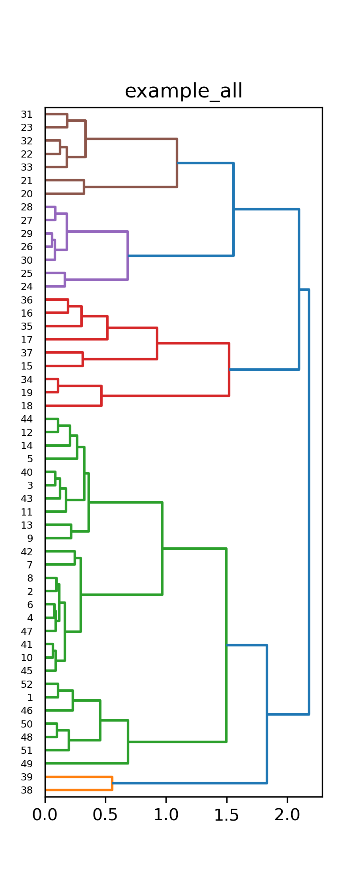

.. _eofs:

=======================================
Empirical Orthogonal Function Analysis
=======================================

**Background on EOFs**

Empirical orthogonal functions (EOFs) are a mathematical tool useful for characterizing a suite of vectors or functions via construction of basis vectors or functions.  Consider :math:`N` atmospheric state vectors, :math:`\vec{A}_n = A_n (\vec{\zeta})`, defined at :math:`M` points, :math:`\zeta_m`, that define a matrix,

.. math::
	\mathbf{A} \left( \vec{\zeta} \right) = 
    \begin{pmatrix}
    A_1 \left( \zeta_1 \right) & A_2 \left( \zeta_1 \right) 	& \cdots 	& A_N \left( \zeta_1 \right) \\
    A_1 \left( \zeta_2 \right) & A_2 \left( \zeta_2 \right) 	& \cdots 	& A_N \left( \zeta_2 \right) \\
    \vdots 				& \vdots					& \ddots	& \vdots 	 \\
    A_1 \left( \zeta_M \right) & A_2 \left( \zeta_M \right)	& \cdots 	& A_N \left( \zeta_M \right)
    \end{pmatrix}
    
Analysis of this :math:`N \times M` matrix to compute EOFs entails first extracting the mean set of values to define perturbations to this mean state, :math:`\vec{\Delta}_j = \vec{A}_j - \bar{\vec{A}}`, and then applying a singular value decomposition (SVD) to define singular values and orthogonal functions,

.. math::
    \mathbf{\Delta}
    \, \xrightarrow{\text{SVD}} \, 
    \bar{\vec{A}}, \sigma_k^{(\mathbf{A})}, \vec{\varepsilon}_k^{(\mathbf{A})}.

The resulting EOF information can be used to reproduce any other other field sampled on the same set of points,

.. math::
	
	\tilde{\vec{A}}_n = \bar{\vec{A}} + \sum_{k = 1}^r{C_k^{(n)} \vec{\varepsilon}_k}, \quad \quad C_k^{(n)} = \vec{\Delta}_n \cdot \vec{\varepsilon}_k = \left( \vec{A}_n - \bar{\vec{A}} \right) \cdot \vec{\varepsilon}_k.
	
Note that the coefficients, :math:`\mathcal{C}_n^{(b)}`, are defined by the projection of the new function onto each EOF (accounting for the mean, :math:`\bar{\vec{A}}`)

Further analysis of the coefficient statistics is included in Blom et al. (2023) and one finds that the mean coefficient value is zero (due to subtraction of the mean above), that coefficients of difference EOF components are statistically independent, and that the variance of each is related directly to the associated singular value,

.. math::

	\bar{C}_k = \frac{1}{N} \sum_n{C_k^{(n)}} = 0, \quad \quad \varsigma_{k,l}^2 = \frac{1}{N} \sum_n{C_k^{(n)} C_l^{(n)}} = \frac{\sigma_k^2}{N} \delta_{k,l}.

**Using EOFs for Re-Sampling and Data Reduction**

In many situations, running propagation simulations through a large historical archive of atmospheric specifications can be cumbersome and time consuming.  In order to avoid this while also capturing the appropriate propagation statistics, the methods in *stochprop* enable data reduction.  Using the above EOF characteristics, one can follow a multi-step method to analyze and re-sample atmospheric data:

    1. Compute and remove the mean state, :math:`\bar{\vec{A}}`, and apply an SVD to compute singular values and EOFs, :math:`\mathbf{\Delta} \, \xrightarrow{\text{SVD}} \, \sigma_k, \vec{\varepsilon}_k`,

    2. Project the specifications from the suite onto the EOFs to define coefficients, :math:`C_k^{(n)} = \vec{\varepsilon}_k \cdot \vec{\Delta}_n`, for :math:`n = 1 \ldots N`` and :math:`k = 1 \ldots r`,

    3. For each EOF index, :math:`k`, use a KDE of the coefficients computed across the suite to approximate the coefficient PDF, :math:`\left\{ C_k^{(1)}, C_k^{(2)}, \ldots C_k^{(N)} \right\} \, \xrightarrow{\text{KDE}} \, \hat{\varrho}_k \left( C \right)`.

    4. Use inverse transform sampling on each individual distribution (this can be done because each coefficient is statistically independent) to generate :math:`M` coefficient values, :math:`\hat{C}_k^{(m)}`, sampled from :math:`\hat{\varrho}_k \left( C \right)`, and use them to construct a set of :math:`M < N`` atmospheric samples,

		.. math:: 

			\hat{\vec{A}}_m = \bar{\vec{A}} + \sum_{k = 1}^r{\hat{C}_k^{(m)} \vec{\varepsilon}_k}    

The way in which :math:`\vec{A}` is defined to building EOFs in *stochprop* is unique in that instead of defining EOF basis functions for each atmospheric field (e.g., zonal wind, meridional wind, pressure, density) and attempting to include covariance between the fields, the entire atmospheric structure is combined into a single vector so that these inter-field dependencies are built into the EOF basis functions.  As noted in Blom et al. (2023), the atmospheric state vector for *stochprop* analysis is defined by stacking the two horizontal wind components along with the adiabatic sound speed, :math:`c = \sqrt{ \gamma \frac{p}{\rho}}` where :math:`\gamma` is the specific heat ratio, :math:`p` is the atmospheric pressure, and :math:`\rho` is the atmospheric density,

	.. math::

		\vec{A}_n = \begin{pmatrix} \vec{c}_n \\ \vec{u}_n \\ \vec{v}_n \end{pmatrix},

where :math:`\vec{c}_n = c_n \left( \vec{z} \right)` is the adiabatic sound speed through the :math:`n^\text{th}` atmosphere sample and :math:`\vec{u}_n` and :math:`\vec{v}_n` denote the zonal and meridional winds in that sample  across the same set of altitudes, :math:`\vec{z}`.  Note that this produces an atmospheric state vector that is three times the length of the original atmospheric specification for a single field. Also, conversion of the pressure and density into sound speed produces an atmospheric state vector containing a single physical units (meters-per-second), so that the EOF basis functions are unitless (the coefficients can be assumed to carry the physical unit scaling).  

Stacking these quantities together into a single atmospheric state vector will couple the two horizontal wind components with pressure and density in the EOF analysis.  The number of EOFs needed to accurately represent a full atmosphere is larger than the number required for a single field; however, preserving the inter-field dependencies and avoiding complicated covariance analysis is preferred to dealing with multiple smaller EOF basis sets with covariance between them.

**Using EOFs to Measure Vector Space Overlap**

Consider a second matrix, :math:`\mathbf{B} \left( \vec{\zeta} \right)` defined by a set of :math:`K` vectors, :math:`\vec{B}_k = B_k \left( \vec{\zeta} \right)`.  This could be a subset of :math:`\mathbf{A}\left( \vec{\zeta} \right)` or a completely separate set of atmospheric data.  Each of the columns in :math:`\mathbf{B}\left( \vec{\zeta} \right)` produces a set of coefficients that can be used to define a distribution via a kernel density estimate (KDE),

.. math::
    \left\{ \mathcal{C}_n^{(B_1)},  \mathcal{C}_n^{(B_2)}, \ldots, \mathcal{C}_n^{(B_K)} \right\}
	\, \xrightarrow{\text{KDE}} \,
	\mathcal{P}_n^{(\mathbf{B})} \left( \mathcal{C} \right).

Comparison of the distributions for various matrices, :math:`\mathbf{B}_1, \mathbf{B}_2, \mathbf{B}_3, \ldots`, allows one to define the relative similarity between different sets by computing the overlap and weighting each term by the EOF singular values,

.. math::
	 \Gamma_{j,k}  =  \sum_n{ \sigma_n \int{\mathcal{P}_n^{(\mathbf{B}_j)} \left( \mathcal{C} \right) \, \mathcal{P}_n^{(\mathbf{B}_k)} \left( \mathcal{C} \right) \, d \mathcal{C} }}

In the case of EOF analysis for atmospheric seasonality and variability, the EOF basis is defined using atmospheric states for the entire year (and likely covering multiple years).  The sets of atmospheres in each :math:`\mathbf{B}_j`, is a subset of :math:`\mathbf{A}` corresponding to a specific month, week, or other interval.  The coefficient overlap can be computed for all combinations to identify seasonality and determine the grouping of intervals (months, weeks, etc.) for which atmospheric structure is similar.

************************
EOF methods in stochprop
************************
Empirical Orthogonal Function analysis methods can be accessed by importing :code:`stochprop.eofs`.  Although analysis can be completed using any set of user defined paths, it is recommended to build a set of directories to hold the eof results, coefficient analyses, and samples produced from seasonal analysis.  As noted in the :ref:`quickstart`, it is often the case that the transitions from summer to winter and winter to summer are overly similar and can be grouped together so that only 3 season definitions are needed.  This pre-analysis set up can be completed manually or by running:

.. code-block:: python

	import os
	import subprocess
	import numpy as np

	from stochprop import eofs

	if __name__ == '__main__':
		eof_dirs = ["eofs", "coeffs", "samples"]
		season_labels = ["winter", "spring", "summer"]

		for dir in eof_dirs:
			if not os.path.isdir(dir):
				subprocess.call("mkdir " + dir, shell=True)

		for season in season_labels:
			if not os.path.isdir("samples/" + season):
				subprocess.call("mkdir samples/" + season, shell=True)

**Load Atmosphere Specifications**

Atmospheric specifications are available through a number of repositories including the Ground-to-Space (G2S) system, the European Centre for Medium-Range Weather Forecasts (ECMWF), and other sources.  A convenient source for G2S specifications is the server maintained by infrasound scientists at the `University of Mississippi's National Center for Physical Acoustics <https://g2s.ncpa.olemiss.edu/>`_.  The current implementation of EOF methods in stochprop assumes the ingested specifications are formatted such that the columns contain altitude, temperature, zonal winds, meridional winds, density, pressure (that is, :code:`zTuvdp` in the infraGA/GeoAc profile options), which is the default output format of the G2S server at NCPA.  

Note: a script is included in the infraGA/GeoAc methods to extract profiles in this format from ECMWF netCDF files.

The atmosphere matrix, :math:`A`, can be constructed using :code:`stochprop.eofs.build_atmo_matrix` which accepts the path where specifications are located and a pattern to identify which files to ingest. 	All G2S specifications in a directory can be ingested for analysis by simply using,

	.. code-block:: python

		A, z0, date_info = eofs.build_atmo_matrix("profs/", "*.dat", return_datetime=True)

This builds the atmosphere matrix, :math:`\mathbf{A}`, above as well as the set of :math:`\vec{z}` altitudes at which the sound speed and winds are sampled for reference.  The flag :code:`return_datetime` is turned on and the date information for each atmosphere in the matrix is preserved and written into a list for reference.  Alternately, specific months, weeks of the year, years, or hours can be defined to limit what information is included in the atmospheric matrix, :math:`A(\vec{z})` (note that when :code:`return_datetime` is not activated only :code:`A` and :code:`z0` are returned),

	.. code-block:: python

		A, z0 = eofs.build_atmo_matrix("profs/", "*.dat", months=['10', '11', '12', '01', '02', '03'])
		A, z0 = eofs.build_atmo_matrix("profs/", "*.dat", weeks=['01', '02'])
		A, z0 = eofs.build_atmo_matrix("profs/", "*.dat", years=['2010'])
		A, z0 = eofs.build_atmo_matrix("profs/", "*.dat", hours=['18'])

Note: a function is included in the CLI (:code:`stochprop.cli.parse_option_list()`) that parses months and weeks for sequences (e.g., '10:12' = '10,11,12'); however, this method is implemented separately from this direct atmosphere matrix construction currently so that each month, week, year, or hour must be listed out in the parameter definitions.  This might be modified in a future update.

**Computing EOFs**

Once the atmosphere matrix, :math:`\mathbf{A}`, has been ingested, EOF analysis can be completed using:

	.. code-block:: python
		
		eofs.compute_eofs(A, z0, "eofs/examples")
		
The analysis results are written into files with prefix specified in the function call ("eofs/examples" in this case).  The contents of the files are summarized is the below table.

+--------------------------------------+-------------------------------------------------------------------------------------------+
| EOF Output File                      | Description                                                                               |
+======================================+===========================================================================================+
| eofs/example-mean_atmo.dat           | Mean values, :math:`\bar{\vec{A}}` in the above discussion                                |
+--------------------------------------+-------------------------------------------------------------------------------------------+
| eofs/example-singular_values.dat     | Singular values corresponding each EOF index                                              |
+--------------------------------------+-------------------------------------------------------------------------------------------+
| eofs/example-snd_spd.eofs            | EOFs for the sound speed, :math:`c = \sqrt{ \gamma \frac{p}{\rho}}`                       |
+--------------------------------------+-------------------------------------------------------------------------------------------+
| eofs/example-merid_winds.eofs        | EOFs for the meridional (north/south) winds                                               |
+--------------------------------------+-------------------------------------------------------------------------------------------+
| eofs/example-zonal_winds.eofs        | EOFs for the zonal (east/west) winds                                                      |
+--------------------------------------+-------------------------------------------------------------------------------------------+

The EOF file formats is such that the first column contains the altitude points, :math:`\vec{z}`, and each subsequent column contains the :math:`n^{th}` EOF, :math:`\vec{\varepsilon}_n^{(A)} \left( \vec{z} \right)`.  As noted above and discussed in Blom et al. (2023), the EOFs are computed using stacked wind and sound speed values to conserve coupling between the different atmospheric parameters and maintain consistent units (velocity) in the EOF coefficients.  The resulting EOFs can be used for a number of analyses including atmospheric updating, seasonal studies, perturbation analysis, and similar analyses.  The below EOFs visualization can be produced using the CLI :code:`stochprop plot eofs` function.

    .. figure:: _static/_images/winter_eofs.png
        :width: 600px
        :align: center
        :figclass: align-center
    
    Mean atmospheric states (left) and the first 5 EOFs for the adiabatic sound speed (upper row) and zonal and meridional winds (lower row, blue and red, respectively) for analysis of the atmosphere for the sample data included in *examples/profs*.

------------------------------------------------------------
Compute Coefficients and Using EOFs to Determine Seasonality
------------------------------------------------------------

As detailed in the :ref:`quickstart`, at mid-latitude locations, the effective sound speed trends can be used to identify seasonality; however, near the equator or poles (and as a general secondary check to ensure robust seasonal trends are identified), seasonal trends can be identified using the EOFs for the entire calendar year.  Coefficient sets can be defined for individual months, weeks, or other sub-intervals, using the :code:`stochprop.eofs.compute_coeffs` function.  For identification of seasonality by month, the coefficient sets are first computed for each individual month using:

.. code-block:: python

	for m in range(52):
		Am, zm, _ = eofs.build_atmo_matrix(atmo_dir, pattern=atmo_pattern, prof_format=atmo_format, weeks=['%02d' % (m + 1)])
		eofs.compute_coeffs(Am, zm, eofs_path, coeff_path + ".week_{:02d}".format(m + 1), eof_cnt=eof_cnt)

The resulting coefficient sets are analyzed using :code:`stochprop.eofs.compute_overlap` to identify how similar various week-to-week combinations are:

.. code-block:: python

    overlap = eofs.compute_overlap(coeffs, eof_cnt=eof_cnt)    
    eofs.compute_seasonality("coeffs/example-overlap.npy", "eofs/example", "coeffs/example")

The output of this analysis is a dendrogram identifying those months that are most similar.  In the below result, the summer season extends from week 20 to 33 and winter covers weeks 38 -- 52 and 1 -- 14 (full discussion in the :ref:`quickstart`).

    
    Clustering analysis on coefficient overlap is used to identify which weeks share common atmospheric structure

----------------------
Command Line interface
----------------------

A command line interface (CLI) for the EOF methods is also included and can be utilized more easily as summarized in the :ref:`quickstart`.  The EOF methods are included in the statistics methods, :code:`stochprop stats` and the usage info can be summarized using the :code:`--help` (or :code:`-h`) option:

	.. code-block:: console

		Usage: stochprop stats [OPTIONS] COMMAND [ARGS]...

		  stochprop stats - Atmospheric statistics methods using Empirical Orthogonal
		  Function (EOF) and related analysis methods.

		Options:
		  -h, --help  Show this message and exit.

		Commands:
		  build-eofs     Build EOFs via an SVD
		  coeff-overlap  Compute EOF coefficient overlap to identify seasonality
		  eof-coeffs     Compute EOF coefficients
		  perturb        Construct perturbed atmospheric models
		  sample-eofs    Sample EOF coefficient KDEs to generate atmosphere realizations

The above tasks (loading atmospheric data and building EOFs) can be accomplished with just a few command line calls.  The construction of results directories is still needed, but the actual EOF analysis can be completed via:

	.. code-block:: none

		stochprop stats build-eofs --atmo-dir profs/ --eofs-path eofs/example_all
		stochprop stats eof-coeffs --atmo-dir profs/ --eofs-path eofs/example_all --run-all-weeks True --coeff-path coeffs/example_all --eof-cnt 50
		stochprop stats coeff-overlap --eofs-path eofs/example_all --coeff-path coeffs/example_all --eof-cnt 50

