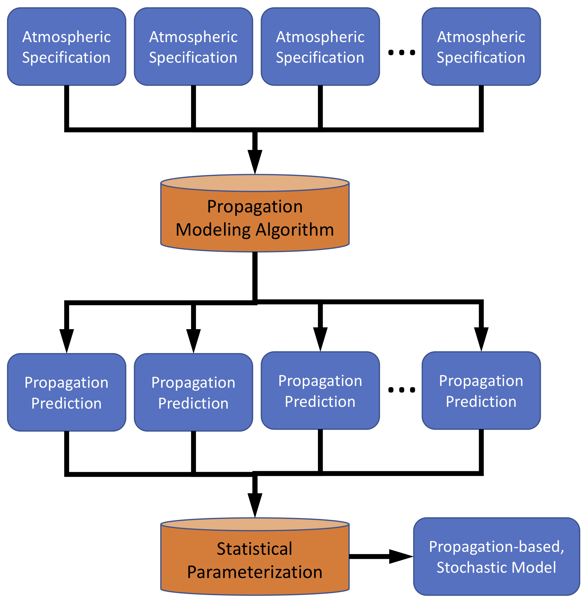

.. _propagation:

=====================================
Propagation Statistics
=====================================

* Overview of building propagation statistics and their use in BISL and SpYE

    
    Stochastic propagation models are constructing using a suite of possible atmospheric states, propagation modeling applied to each, and a statistical model describing the variability in the resulting set of predicted effects

********************************
Path Geometry Models (PGMs)
********************************

* Run infraga methods...

.. code:: Python

    from stochprop import propagation

	propagation.run_infraga(sample_dirs + "/" + season, results_dir + "/" + season + "/" + season + ".arrivals.dat", cpu_cnt=cpu_cnt, geom="sph", inclinations=[5.0, 45.0, 1.5], azimuths=azimuths, src_loc=src_loc)

* Ingest arrival file and build a path geometry model...

.. code:: Python

        pgm = propagation.PathGeometryModel()
        pgm.build(results_dir + "/" + season + "/" + season + ".arrivals.dat", results_dir + "/" + season + "/" + season + ".pgm", show_fits=False, geom="sph", src_loc=src_loc)

* Load modeland visualize...

.. code:: Python

        pgm.load(results_dir + "/" + season + "/" + season + ".pgm", smooth=True)
        pgm.display(file_id=(results_dir + "/" + season + "/" + season), subtitle=season)

* Use in InfraPy BISL...

.. code:: Python

        pgm.display(file_id=(results_dir + "/" + season + "/" + season), subtitle=season)

********************************
Transmission Loss Models (TLMs)
********************************

* Run NCPAprop modess methods...

.. code:: Python

    from stochprop import propagation

    propagation.run_modess(sample_dirs + "/" + season, results_dir + "/" + season + "/" + season, azimuths=azimuths, freq=0.1)

* Ingest arrival file and build a path geometry model...

.. code:: Python

    tlm = propagation.TLossModel()
    tlm.build(results_dir + "/" + season + "/" + season + "_%.3f" %fn + ".nm", results_dir + "/" + season + "/" + season + "_%.3f" %fn + ".tlm", show_fits=False)

* Load modeland visualize...

.. code:: Python

    tlm.load(results_dir + "/" + season + "/" + season + "_%.3f" %fn + ".tlm")
    tlm.display(file_id=(results_dir + "/" + season + "/" + season + "_%.3f" %fn), title=("Transmission Loss Statistics" + '\n' + season + ", %.3f" %fn + " Hz"))

* Use in InfraPy BISL...

.. code:: Python

        pgm.display(file_id=(results_dir + "/" + season + "/" + season), subtitle=season)

