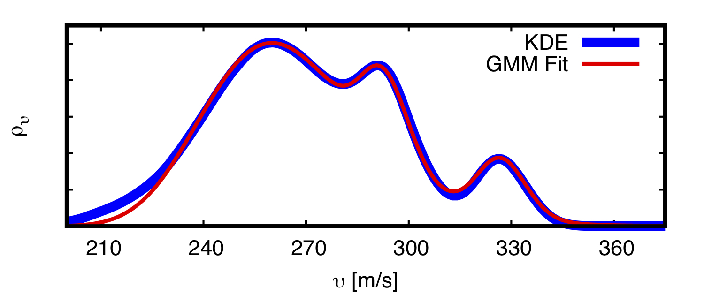

.. _propagation:

======================
Propagation Statistics
======================

----------------------------------------------
Visualizing Effective Sound Speed Ratio Trends
----------------------------------------------

As discussed in the :ref:`quickstart`, in addition to the EOF-based method of identifying seasonal trends, it's often useful to consider the effective sound speed ratio in the east and westward directions to identify seasonal trends.  Such analysis can be performed using the :code:`stochprop plot ess-ratio` methods to ingest a set of atmospheric specifications, averaging across years and computing the altitudes for which the effective sound speed in a given direction exceeds that near the ground.  

    .. code-block:: none

        #####################################
        ##                                 ##
        ##            stochprop            ##
        ##      Visualization Methods      ##
        ##   ESS Ratio Seasonal Analysis   ##
        ##                                 ##
        #####################################

        Run summary:
            Source directory: profs/
            Specification pattern: \*.dat
            Specification format: zTuvdp
            Output path: example

            Loading profiles from profs/ with pattern: \*.dat
                Extracted ground elevation: 0.165

        Computing effective sound speed ratio for each day-of-year...

        Eastward waveguide changes...
            Waveguide dissipates: April 10  (yday: 101, week: 14)
            Waveguide forms: April 11  (yday: 102, week: 15)
            Waveguide dissipates: April 12  (yday: 103, week: 15)
            Waveguide forms: September 23  (yday: 267, week: 38)

        Westward waveguide changes...
            Waveguide forms: May 02  (yday: 123, week: 18)
            Waveguide dissipates: May 04  (yday: 125, week: 18)
            Waveguide forms: May 11  (yday: 132, week: 19)
            Waveguide dissipates: August 29  (yday: 242, week: 35)

This analysis also produces a visualization of the effective sound speed trends.  Discussion of the function output regarding waveguide formation and dissipation as well as the figure itself is included in the :ref:`quickstart`.

	.. figure:: _static/_images/example.ess-ratio.png
		:width: 1000px
		:align: center
		:alt: alternate text
		:figclass: align-center

-------------------------------
Building Propagation Statistics
-------------------------------

Propagation statistics for path geometry (e.g., arrival location, travel time, direction of arrival) and transmission loss can be computed for use in improving localization and yield estimation analyses, respectively.  In the case of localization, a general celerity (horizontal group velocity) model is available in InfraPy constructed as a three-component Gaussian-mixture-model (GMM).  This model contains peaks corresponding to the tropospheric, stratospheric, and thermospheric waveguides and has been defined by fitting the parameterized GMM to a kernel density estimate of a full year of ray tracing analyses.

    
    A general travel time model includes three components corresponding to the tropospheric, stratospheric, and thermospheric waveguides.

More specific models can be constructed from a suite of atmospheric states describing a location and seasonal trend (e.g., winter in the western US).  Propagation simulations are run using the suite of atmospheric states and a statistical model is defined using the outputs to quantify the probability of a given arrival characteristic.  

.. figure:: _static/_images/stochprop_fig1.jpg
    :width: 500px
    :align: center
    :alt: alternate text
    :figclass: align-center
    
    Stochastic propagation models are constructing using a suite of possible atmospheric states, propagation modeling applied to each, and a statistical model describing the variability in the resulting set of predicted effects

**Path Geometry Models (PGMs)**

Path geometry models describing the arrival location, travel time, direction of arrival (back azimuth, inclination angle) can be computed using ray tracing simulations such as those in the InfraGA/GeoAc package.  Ray tracing simulations can be run for all atmospheric specification files in a given directory using the :code:`stochprop.propagation.run_infraga` method by specifying the directory, output file, geometry (3D Cartesian or spherical), CPU count (if the infraGA/GeoAc OpenMPI methods are installed), azimuth and inclination angle ranges, and source location.  The default parameters for this method set a ground reflection (bounce) limit of 25 and a maximum propagation range of 1000 km.  Inclination angles cover from :math:`1^\circ` to :math:`60^\circ` with a :math:`1^\circ` resolution and azimuth angles cover all directions with a resolution of :math:`3^\circ`.  The ground surface is assumed to be at sea level but can be modified using :code:`z_grnd` (inclusion of terrain in PGM and TLM simulations is an ongoing area of R&D).  If the infraGA/GeoAc methods aren't on your path, you should use :code:`infraga_path` to define where they are located.  Atmospheric samples can been computed for the example winter season, ray tracing simulations can be run using:

.. code:: Python

    from stochprop import propagation

    propagation.run_infraga("samples/winter/example-winter", "prop/winter/example-winter.arrivals.dat", cpu_cnt=12, geom="sph", inclinations=[5.0, 45.0, 1.5], azimuths=azimuths, src_loc=src_loc)

The resulting infraGA/GeoAc arrival files are concatenated into a single arrivals file ('prop/winter/example-winter.arrivals.dat') and can be ingested to build a path geometry model by once again specifying the geometry and source location.

.. code:: Python

        pgm = propagation.PathGeometryModel()
        pgm.build("prop/winter/example-winter.arrivals.dat", "prop/winter/example-winter.pgm", geom="sph", src_loc=src_loc)

This produces a file, 'prop/winter/example-winter.pgm', defined using Python's pickle serialization (output file format might be modified in the future).  The path geometry model file can later be loaded into a :code:`stochprop.propagation.PathGeometryModel` instance and visualized to investigate the propagation statistics:

.. code:: Python

        pgm.load("prop/winter/example-winter.pgm")
        pgm.display(file_id="prop/winter/example-winter", subtitle="winter")

.. figure:: _static/_images/winter-PGMs.jpg
    :width: 850px
    :align: center
    :alt: alternate text
    :figclass: align-center
    
    Stochastic propagation-based path geometry model examples for a winter shows the expected stratospheric waveguide for propagation to the east and azimuth deviations to the north and south due to the strong stratospheric cross winds.

The path geometry models constructed here can be utilized in the InfraPy Bayesian Infrasonic Source Localization (BISL) analysis by specifying them as the :code:`path_geo_model` for that analysis.
                    
**Transmission Loss Models (TLMs)**

Similarly, analysis of source characteristics includes estimation of the power of the acoustic signal at some reference distance from the (typically) complex source mechanism.  Such analysis using regional signals requires a propagation model that relates the energy losses along the path, termed the transmission loss and in the case of infrasonic analysis, several methods are available in the `NCPAprop <https://github.com/chetzer-ncpa/ncpaprop>`_  software suite from the University of Mississippi.  The NCPAprop modal analysis using the effective sound speed, :code:`modess`, can be accessed from :code:`stochprop.propagation.run_modess` to compute transmission loss predictions for all atmospheric specifications in a directory in a similar fashion to the methods above for infraGA/GeoAc.

.. code:: Python

    from stochprop import propagation

    f_min, f_max, f_cnt = 0.01, 1.0, 10
    f_vals = np.logspace(np.log10(f_min), np.log10(f_max), f_cnt)

    for fn in f_vals:
    	propagation.run_modess("samples/winter/example-winter", "prop/winter/example-winter", azimuths=azimuths, freq=fn, clean_up=True, cpu_cnt=cpu_cnt)

The default parameter values in this function define an azimuthal resolution of :math:`3^\circ` covering all directions and again assume a :code:`z_grnd` value of 0 corresponding to sea level in the atmospheric specifications.  A maximum propagation range of 1000 km is assumed.  Similar to the :code:`infraga_path` parameter above, the path to the NCPAprop binaries needs to be specified via :code:`ncpaprop_path` parameter if it's not on your path.  Unlike the infraGA/GeoAc ray tracing simulations, NCPAprop methods require a frequency for analysis, which defaults to 0.1 Hz.  For typical applications, a suite of frequency values are needed to apply the estimated transmission loss across a signals spectra (in Blom et al. (2023) frequencies of 0.05, 0.1, 0.2, 0.5, and 1.0 Hz were computed).

Each run of this method produces a pair of output files, :code:`prop/winter/example-winter_0.100Hz.nm` and :code:`prop/winter/example-winter_0.100Hz.lossless.nm` that contain the predicted transmission loss with and without thermo-viscous absorption losses.  The transmission loss predictions are loaded in frequency by frequency and statistics for transmission as a function of propagation range and azimuth are constructed and written into specified files,

.. code:: Python

    for fn in f_vals:
    	tlm = propagation.TLossModel()
    	tlm.build("prop/winter/example-winter" + "_%.3f" %fn + ".nm", "prop/winter/example-winter" + "_%.3f" %fn + ".tlm")

TLM files are written (e.g., 'prop/winter/example-winter0.100Hz.tlm') and saved for later use. The transmission loss model can later be loaded into a :code:`stochprop.propagation.TLossModel` instance and visualized to investigate the propagation statistics similarly to the path geometry models.

.. code:: Python

    tlm.load("prop/winter/example-winter_0.359Hz.tlm")
    tlm.display(file_id=("prop/winter/example-winter_0.359Hz), title=("Transmission Loss Statistics" + '\n' + "winter, 0.359 Hz"))

.. figure:: _static/_images/winter_0.359_tloss.png
    :width: 500px
    :align: center
    :alt: alternate text
    :figclass: align-center
    
    Transmission loss statistics used for source characterization can be constructed using analysis of NCPAprop normal mode algorithm output.

The transmission loss models constructed in *stochprop* can be utilized in the InfraPy Spectral Yield Estimation (SpYE) algorithm by specifying a set of models and their associated frequencies (see InfraPy example for detection and waveform data setup).

----------------------
Command Line interface
----------------------

Command line methods are included to access the propagation model construction and visualization.  The CLI methods merge the infraGA/GeoAc and NCPAprop simulation calls to the model statistics build so that construction requires a single command line call.    Usage info for the propagation model methods can be displayed by running :code:`stochprop prop --help`:

    .. code-block:: console

        stochprop prop - Construct and interact with stochastic propagation models

        Options:
          -h, --help  Show this message and exit.

        Commands:
          build-pgm  Build a path geometry model (PGM)
          build-tlm  Build a transmission loss model (TLM)      

The model construction above can be completed from the command line by specifying the directory containing the atmospheric specifications, output path, and any run parameters,

    .. code-block:: none

        stochprop prop build-pgm --atmo-dir samples/winter --output-path prop/winter/winter --src-loc '30.0, -120.0, 0.0' --cpu-cnt 8
        stochprop plot prop-model --model-file prop/winter/winter.pgm

        stochprop prop build-tlm --atmo-dir samples/winter --output-path prop/winter/winter --freq 0.1  --cpu-cnt 8
        stochprop plot prop-model --model-file prop/winter/winter_0.100Hz.tlm

One notable option that can be useful in constructing models is the :code:`--clean-up` flag that determines whether propagation simulation results from individual atmospheric specifications are kept after the results have been merged.  This parameter defaults to True, but it's recommended to turn it to False when initially building models to be sure individual results can be evaluated if necessary.  In the case that simulations are interrupted, this flag being turned to False so that individual results aren't removed aids in re-starting the analysis because the wrappers for the infraGA/GeoAc and NCPAprop methods check whether results are present for a given atmospheric file and skip that file if results are found (this also means that when a simulation campaign is interrupted, the last file that is likely incomplete should be removed before resuming the model construction).