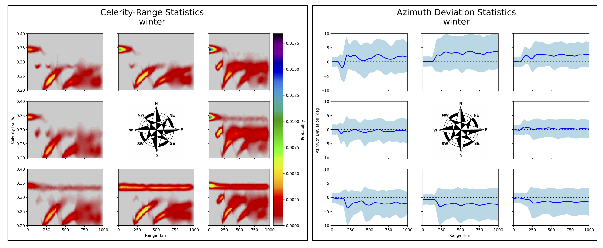

.. _propagation:

=====================================
Propagation Statistics
=====================================

**********************************************
Visualizing Effective Sound Speed Ratio Trends
**********************************************

It should be noted that in addition to the EOF-based method of identifying seasonal trends, it's often useful to consider the effective sound speed ratio in the east and westward directions.  Such analysis can be performed using the :code:`stochprop prop season-trends` methods to ingest a set of atmospheric specifications, averaging across years and computing the altitudes for which the effective sound speed in a given direction exceeds that near the ground.  

	.. code-block:: none

		##########################$#########
		##                                ##
		##           stochprop            ##
		##      Propagation Methods       ##
		##   ESS Ratio Seasonal Analysis  ##
		##                                ##
		####################################

		Run summary:
		Source directory: profs/
		Specification pattern: *.dat
		Specification format: zTuvdp
		Output path: example

			Loading profiles from profs/ with pattern: *.dat
				Extracted ground elevation: 1.589

		Computing effective sound speed ratio for each day-of-year...

		Eastward waveguide changes...
			Waveguide dissipates: January 22  (yday: 22, week: 3)
			Waveguide forms: January 24  (yday: 24, week: 3)
			Waveguide dissipates: January 25  (yday: 25, week: 4)
			Waveguide forms: January 26  (yday: 26, week: 4)
			Waveguide dissipates: January 31  (yday: 31, week: 4)
			Waveguide forms: February 02  (yday: 33, week: 5)
			Waveguide dissipates: April 25  (yday: 116, week: 17)
			Waveguide forms: September 28  (yday: 272, week: 39)

		Westward waveguide changes...
			Waveguide forms: January 18  (yday: 18, week: 3)
			Waveguide dissipates: February 02  (yday: 33, week: 5)
			Waveguide forms: May 12  (yday: 133, week: 19)
			Waveguide dissipates: August 23  (yday: 236, week: 34)
			Waveguide forms: August 29  (yday: 242, week: 35)
			Waveguide dissipates: August 30  (yday: 243, week: 35)

	This analysis also produces a visualization of the effective sound speed trends as shown below

	.. figure:: _static/_images/example.ess-ratio.png
		:width: 1000px
		:align: center
		:alt: alternate text
		:figclass: align-center

*******************************
Building Propagation Statistics
*******************************

* Propagation statistics for path geometry (e.g., arrival location, travel time, direction of arrival) and transmission loss can be computed for use in improving localization and yield estimation analyses, respectively.
* In the case of localization, a general celerity (horizontal group velocity) model is available in InfraPy constructed as a three-component Gaussian-mixture-model (GMM).  This model contains peaks corresponding to the tropospheric, stratospheric, and thermospheric waveguides and has been defined by fitting the parameterized GMM to a kernel density estimate of a full year of ray tracing analyses.

.. figure:: _static/_images/cel_dist.jpg
    :width: 500px
    :align: center
    :alt: alternate text
    :figclass: align-center
    
    A general travel time model includes three components corresponding to the tropospheric, stratospheric, and thermospheric waveguides.

* More specific models can be constructed from a limite suite of atmospheric states describing a location and seasonal trend (e.g., winter in the western US) or using an atmospheric state for a specific event with some perturbation analysis.  In either case, propagation simulations are run using the suite of atmospheric states and a statistical model is defined using the outputs to quantify the probability of a given arrival characteristic.  

.. figure:: _static/_images/stochprop_fig1.jpg
    :width: 500px
    :align: center
    :alt: alternate text
    :figclass: align-center
    
    Stochastic propagation models are constructing using a suite of possible atmospheric states, propagation modeling applied to each, and a statistical model describing the variability in the resulting set of predicted effects

**Path Geometry Models (PGMs)**

* Path geometry models describing the arrival location, travel time, direction of arrival (back azimuth, inclination angle) can be computed using geometric modeling simulations such as those in the InfraGA/GeoAc package.  

* Ray tracing simulations can be run for all atmospheric specification files in a given directory using the :code:`stochprop.propagation.run_infraga` method by specifying the directory, output file, geometry (3D Cartesian or spherical), CPU count (if the infraGA/GeoAc OpenMPI methods are installed), azimuth and inclination angle ranges, and source location

    * Note: the source location is primarily used in the spherical coordinate option to specify the latitude and longitude of the source, but should also contain the ground elevation for the simulation runs as the third element (e.g., for a source at 30 degrees latitude, 100 degrees longitude, and a ground elevation of 1 km, specify :code:`src_loc=(0.0, 0.0, 1.0)` or :code:`src_loc=(30.0, 100.0, 1.0)` for the :code:`geom="3d"` or :code:`geom="sph"` options, respectively).

.. code:: Python

    from stochprop import propagation

    propagation.run_infraga("samples/winter/example-winter", "prop/winter/example-winter.arrivals.dat", cpu_cnt=12, geom="sph", inclinations=[5.0, 45.0, 1.5], azimuths=azimuths, src_loc=src_loc)

* The resulting infraGA/GeoAc arrival files are concatenated into a single arrivals file and can be ingested to build a path geometry model by once again specifying the geometry and source location.

.. code:: Python

        pgm = propagation.PathGeometryModel()
        pgm.build("prop/winter/example-winter.arrivals.dat", "prop/winter/example-winter.pgm", geom="sph", src_loc=src_loc)

* The path geometry model can later be loaded into a :code:`stochprop.propagation.PathGeometryModel` instance and visualized to investigate the propagation statistics.

.. code:: Python

        pgm.load("prop/winter/example-winter.pgm")
        pgm.display(file_id="prop/winter/example-winter", subtitle="winter")

    
    Stochastic propagation-based path geometry model examples for a winter shows the expected stratospheric waveguide for propagation to the east and azimuth deviations to the north and south due to the strong stratospheric cross winds.

* The path geometry models constructed here can be utilized in the InfraPy Bayesian Infrasonic Source Localization (BISL) analysis by specifying them as the :code:`path_geo_model` for that analysis.

.. code:: Python

    from infrapy.location import bisl
	
    det_list = lklhds.json_to_detection_list('data/detection_set2.json')
    result, pdf = bisl.run(det_list, path_geo_model=pgm)
                    
**Transmission Loss Models (TLMs)**

* Analysis of source characteristics includes estimation of the power of the acoustic signal at some reference distance from the (typically) complex source mechanism

* Such analysis using regional signals requires a propagation model that relates the energy losses along the path, termed the transmission loss and in the case of infrasonic analysis, several methods are available in the NCPAprop software suite from the University of Mississippi

* The NCPAprop modal analysis using the effective sound speed, :code:`modess`, can be accessed from :code:`stochprop.propagation.run_modess` to compute transmission loss predictions for all atmospheric specifications in a directory in a similar fashion to the methods above for infraGA/GeoAc.

.. code:: Python

    from stochprop import propagation

    f_min, f_max, f_cnt = 0.01, 1.0, 10
    f_vals = np.logspace(np.log10(f_min), np.log10(f_max), f_cnt)

    for fn in f_vals:
    	propagation.run_modess("samples/winter/example-winter", "prop/winter/example-winter", azimuths=azimuths, freq=fn, clean_up=True, cpu_cnt=cpu_cnt)

* Each run of this method produces a pair of output files, :code:`prop/winter/example-winter_0.100Hz.nm` and :code:`prop/winter/example-winter_0.100Hz.lossless.nm` that contain the predicted transmission loss with and without thermo-viscous absorption losses.

* The transmission loss predictions are loaded in frequency by frequency and statistics for transmission as a function of propagation range and azimuth are constructed and written into specified files,

.. code:: Python

    for fn in f_vals:
    	tlm = propagation.TLossModel()
    	tlm.build("prop/winter/example-winter" + "_%.3f" %fn + ".nm", "prop/winter/example-winter" + "_%.3f" %fn + ".tlm")

* The transmission loss model can later be loaded into a :code:`stochprop.propagation.TLossModel` instance and visualized to investigate the propagation statistics similarly to the path geometry models.

.. code:: Python

    tlm.load("prop/winter/example-winter_0.359Hz.tlm")
    tlm.display(file_id=("prop/winter/example-winter_0.359Hz), title=("Transmission Loss Statistics" + '\n' + "winter, 0.359 Hz"))

.. figure:: _static/_images/winter_0.359_tloss.png
    :width: 500px
    :align: center
    :alt: alternate text
    :figclass: align-center
    
    Transmission loss statistics used for source characterization can be constructed using analysis of NCPAprop normal mode algorithm output.

* The transmission loss models constructed in :code:`stochprop` can be utilized in the InfraPy Spectral Yield Estimation (SpYE) algorithm by specifying a set of models and their associated frequencies (see InfraPy example for detection and waveform data setup),

.. code:: Python

    from infrapy.characterization import spye

    # Define detection list, signal-minus-signal spectra, 
    # source location, and analysis frequency band
        
    tlms = [0] * 2
    tlms[0] = list(f_vals)
    tlms[1] = [0] * f_cnt
    
    for n in range(f_cnt):
        tlms[1][n] = propagation.TLossModel()
        tlms[1][n].load("prop/winter/example-winter_" + "%.3f" % models[0][n] + "Hz.tlm")

    yld_vals, yld_pdf, conf_bnds = spye.run(det_list, smn_specs, src_loc, freq_band, tlms)

**********************
Command Line interface
**********************

* Command line methods are included to access the propagation model construction and visualization.  Usage info for the propagation model methods can be displayed by running :code:`stochprop prop --help`:

    .. code-block:: console

        Usage: stochprop prop [OPTIONS] COMMAND [ARGS]...

        stochprop prop - Construct and interact with stochastic propagation models

        Options:
        -h, --help  Show this message and exit.

        Commands:
        build-pgm  Build a path geometry model (PGM)
        build-tlm  Build a transmission loss model (TLM)
        plot       Visualize a PGM or TLM        

* The model construction above and be completed from the command line by specifying the directory containing the atmospheric specifications, output path, and any run parameters,

    .. code-block:: console

        >> stochprop prop build-pgm --atmos-dir samples/winter --output-path prop/winter/winter --src-loc '[30.0, -120.0, 0.0]'  --cpu-cnt 6
        >> stochprop prop plot --model-file prop/winter/winter.pgm

        >> stochprop prop build-tlm --atmos-dir samples/winter --output-path prop/winter/winter --freq 0.1  --cpu-cnt 6
        >> stochprop prop plot --model-file prop/winter/winter_0.100Hz.tlm

* The resulting models can be used in the InfraPy BISL and SpYE localizationa and yield estimation methods, respectively, as detailed in the InfraPy documentation:

    .. code-block:: bash 

        infrapy run_loc --local-detect-label data/detection_set2.json --local-loc-label data/location2 --pgm-file ../infrapy/propagation/priors/UTTR_models/UTTR_06_1800UTC.pgm

        infrapy run_yield --local-wvfrms '../infrapy-data/hrr-5/*/*.sac' --local-detect-label data/HRR-5.dets.json --src-lat 33.5377 --src-lon -106.333961 --tlm-label "../infrapy/propagation/priors/tloss/2007_08-" --local-yld-label "HRR-5"

    where :code:`UTTR_06_1800UTC.pgm` denotes a path geometry model for the Utah Test and Training Range (UTTR) during June at 18:00 UTC and there are a series of transmission loss models (:code:`2007_08-0.025Hz.tlm`, :code:`2007_08-0.003Hz.pri`, etc.) that contain transmission loss statistics at individual frequencies for the yield estimation analysis.