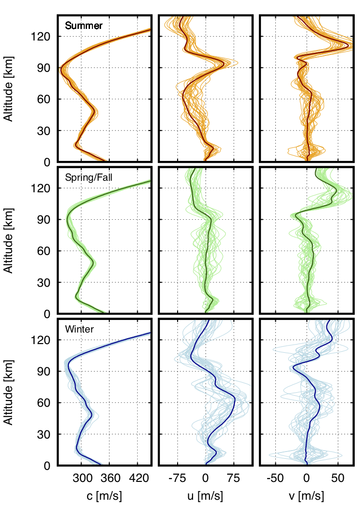
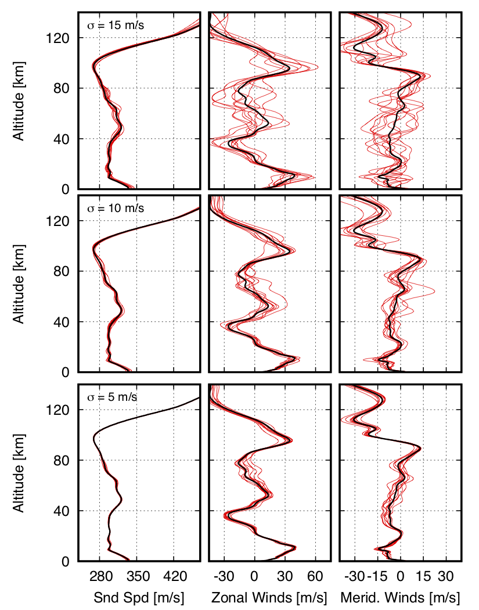

.. _sampling:

===============================================
Atmospheric Fitting, Sampling, and Perturbation
===============================================

* The Empirical Orthogonal Functions (EOFs) constructed using a suite of atmospheric specifications can be utilized in a number of different analyses of the atmospheric state
* In general, an atmospheric state can be constructed by defining a reference atmosphere, :math:`b_0 \left( z_m \right)`, and a set of coefficients, :math:`\mathcal{C}_n`,

.. math::
	\hat{b} \left( z_m \right) = b_0 \left( z_m \right) + \sum_n{ \mathcal{C}_n \mathcal{E}_n \left( z_m \right)},
		

***********************************************
Fitting an Atmospheric Specification using EOFs
***********************************************

* In the case that a specific state, :math:`b \left(z_m \right)`, is known, it can be approximated using the EOF set by using the mean state pulled from the original SVD analysis and coefficients defined by projecting the atmospheric state difference from this mean onto each EOF,

.. math::
   	b_0 \left( z_m \right) = \bar{a}  \left( z_m \right) , \quad \quad \mathcal{C}_n^{(b)} = \sum_m{\mathcal{E}_n \left( z_m \right) \left( b \left( z_m \right) - \bar{a} \left( z_m \right) \right)},

* These coefficient calculations and construction of a new atmospheric specification can be completed using :code:`stochprop.eofs.fit_atmo` with the path to specific atmospheric state, a set of EOFs, and a specified number of coefficients to compute,

.. code:: Python

    prof_path = "profs/01/g2stxt_2010010100_39.7393_-104.9900.dat"
    eofs_path = "eofs/example"
	
    eofs.fit_atmo(prof_path, eofs_path, "eof_fit-N=30.met", eof_cnt=30)

* This analysis is useful to determine how many coefficients are needed to accurately reproduce an atmospheric state from a set of EOFs.  Such an analysis is shown below for varying number of coefficients and convergence is found at 50 - 60 terms.

.. figure:: _static/_images/US_NE-fits.png
    :width: 700px
    :align: center
    :alt: alternate text
    :figclass: align-center
    
    Accuracy of fitting a specific atmospheric state (black) using varying numbers of EOF coefficients (red) shows convergence for approximately 50 - 60 terms in the summation

************************************************************
Sampling Specifications using EOF Coefficient Distributions
************************************************************

* Samples can be generated that are representative of a given coefficient distributions as constructed using :code:`stochprop.eofs.compute_coeffs` or a combination of them.  
* In such a case, the reference atmosphere is again the mean state from the SVD analysis and the coefficients are randomly generated from the distributions defined by kernel density estimates (KDE's) of the coefficient results

.. math::
   	b_0^{(B)} \left( z_m \right) = \bar{a}  \left( z_m \right) , \quad \quad \mathcal{C}_n \longleftarrow \mathcal{P}_n^{(B)} \left( \mathcal{C} \right)
   	
* In addition to sampling the coefficient distributions, the maximum likelihood atmospheric state can be defined by defining each coefficient to be the maximum of the distribution,

.. math::
   	b_0^{(B)} \left( z_m \right) = \bar{a}  \left( z_m \right) , \quad \quad \mathcal{C}_n = \text{argmax} \left[ \mathcal{P}_n^{(B)} \left( \mathcal{C} \right) \right]

* This sampling and maximum likelihood calculation can be run by loading coefficient results and running,

.. code:: Python

    coeffs = np.load("coeffs/example_05-coeffs.npy")
    coeffs = np.vstack((coeffs, np.load("coeffs/example_06-coeffs.npy")))
    coeffs = np.vstack((coeffs, np.load("coeffs/example_07-coeffs.npy")))
    coeffs = np.vstack((coeffs, np.load("coeffs/example_08-coeffs.npy")))
    
    eofs.sample_atmo(coeffs, eofs_path, "samples/summer/example-summer", prof_cnt=25)
    eofs.maximum_likelihood_profile(coeffs, eofs_path, "samples/example-summer")

* This analysis can be completed for each identified season to generate a suite of atmospheric specifications representative of the season as shown in the figure below.  This can often provide a significant amount of data reduction for propagation studies as multiple years of specifications (numbering in the 100's or 1,000's) can be used to construct a representative set of 10's of atmospheres that characterize the time period of interest as in the figure below.

    Samples for seasonal trends in the western US show the change in directionality of the stratospheric waveguide in summer and winter

****************************************************
Perturbing Specifications to Account for Uncertainty
****************************************************

* In most infrasonic analysis, propagation analysis through a specification for the approximate time and location of an event doesn't produce the exact arrivals observed due to the dynamic and sparsely sampled nature of the atmosphere

* Because of this, it is useful to apply random perturbations to the estimated atmospheric state covering some confidence level and consider propagation through the entire suite of "possible" states

* In such a case, the reference atmosphere, :math:`c_0 \left( z_m \right)` defines the initial states, coefficients are randomly generated from a normal distribution, and weighting is applied based on the singular values and mean altitudes of the EOFs,
.. math::
   	b_0 \left( z_m \right) = c_0 \left( z_m \right), \quad \quad \mathcal{C}_n \longleftarrow \mathcal{N} \left(0, \sigma^* \right), \quad \quad w_n = \mathcal{S}_n^{\gamma} \; \bar{z}_n^{\eta}

* The set of perturbations is scaled to match the specified standard deviation after summing over coefficients and averaged over the entire set of altitudes

* Unlike the above methods, in this analysis a weighting is defined by the singular value of the associated EOF and the mean altitude of the EOF, :math:`\bar{z}_n = \sum_m{z_m \mathcal{E}_n \left( z_m \right)}` in order to avoid rapidly oscillating EOFs from contributing too much noise and to focus perturbations at higher altitudes where uncertainties are larger, respectively.  The exponential coefficients have default values of :math:`\gamma = 0.25` and :math:`\eta=2`, but can be modified in the function call.

* This perturbation analysis can be completed using :code:`stochprop.eofs.perturb_atmo` with a specified starting atmosphere, set of EOFs, output path, uncertainty measure in meters-per-second, and number of samples needed,

.. code:: Python

    eofs.perturb_atmo(prof_path, eofs_path, "eof_perturb", uncertainty=5.0, sample_cnt=10)

* The below figure shows a sampling of results using uncertainties of 5.0, 10.0, and 15.0 meters-per-second.  The black curve is input as the estimated atmospheric state and the red curves are generated by the perturbations.

    Perturbations to a reference atmospheric state can be computed using randomly generated coefficients for a suite of EOFs with specified standard deviation

