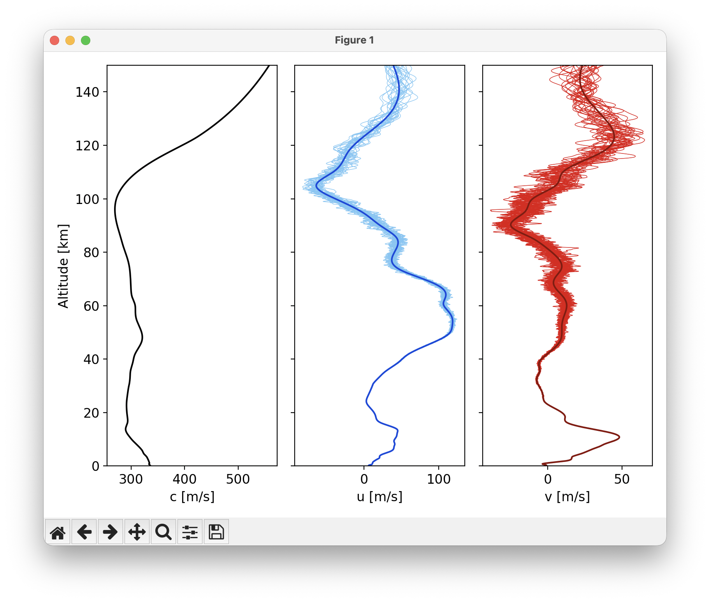

.. _gravity:

==========================
Gravity Wave Perturbations
==========================
Atmospheric specifications available for a given location and time (e.g., G2S) are averaged over some spatial and temporal scale so that sub-grid scale fluctuations must be estimated stochastically and applied in order to construct a suite of possible atmospheric states.  The dominant source of such sub-grid fluctuations in the atmosphere is that of buoyancy or gravity waves.  Stochastic gravity wave perturbation methods are included in *stochprop* using an approach based on the vertical ray tracing approach detailed in Drob et al. (2013) and are summarized below for reference.

********************************
Freely Propagating Gravity Waves
********************************

Gravity wave dynamics are governed by a pair relations describing the dispersion and wave action conservation.  The dispersion relation describing the vertical wavenumber, :math:`m`, can be expressed as,

	.. math::
		m^2 \left( k, l, \omega, z \right) = \frac{k_\perp^2}{\hat{\omega}^2} \left( N^2 - \hat{\omega}^2 \right) + \frac{1}{4H^2}
 
In this relation :math:`k` and :math:`l` are the zonal and meridional wave numbers, respectively, :math:`k_\perp^2 = \sqrt{k^2 + l^2}` is the combined horizontal wavenumber.  The density scale height, :math:`H = - \rho_0 \times \left( \frac{\partial \rho_0}{\partial z} \right)^{-1}` is computed from the gradient of the ambient density, :math:`\rho_0 \left( z \right)`, and can be used to represent the atmospheric buoyancy (Brunt-Väisälä) frequency, :math:`N = \sqrt{-\frac{g}{\rho_0} \frac{\partial \rho_0}{\partial z}} = \sqrt{\frac{g}{H}}`.  The intrinsic angular frequency (relative to the moving air), :math:`\hat{\omega}`, is defined from to the absolute angular frequency (relative to the ground), :math:`\omega`, horizontal wavenumbers, and winds,

	.. math::
		\hat{\omega} \left( k, l, \omega, z \right) = \omega - k u_0 \left( z \right) - l v_0 \left( z \right)

This dispersion relation can be solved for :math:`\hat{\omega}` and then differentiated to define the vertical group velocity,

	.. math::
		\hat{\omega} = \frac{k_\perp N \left( z \right)}{\sqrt{ k_\perp^2 + m^2 \left( z \right) + \frac{1}{4 H^2 \left( z \right)}}} \quad \rightarrow \quad 
		c_{g,z} \left(k, l, \omega, z \right) = \frac{\partial \hat{\omega}}{\partial m} = -\frac{m k_\perp N}{\left( k_\perp^2 + m^2 + \frac{1}{4 H^2} \right)^\frac{3}{2}} 

The conservation of wave action leads to a condition on the vertical velocity perturbation spectrum that can be used to define a freely propagating solution,

	.. math::
		\rho_0 m \left| \hat{w} \right|^2 = \text{constant} \; \rightarrow \;
		\hat{w} \left( k, l, \omega, z \right) = \hat{w}_0 e^{i \varphi_0} \sqrt{ \frac{\rho_0 \left( z_0 \right)}{\rho_0 \left( z \right)} \frac{m \left( z_0 \right)}{m \left( z \right)}} e^{i \int_{z_0}^z{m \left( z^\prime \right) dz^\prime}}

The vertical velocity spectra defined here can be related to the horizontal velocities, 

	.. math::
		\hat{u} = - \frac{k m}{k_\perp^2} \hat{w}, \quad
		\hat{v} = - \frac{l m}{k_\perp^2} \hat{w}.

Finally, once computed for the entire atmosphere, the spatial and temporal domain forms can be computed by an inverse Fourier transform,

	.. math::
		w \left( x, y, z, t \right) = \int{e^{-i \omega t} \left( \iint{ \hat{w} \left( k, l, \omega, z \right) e^{i \left( kx + ly \right)} dk \, dl} \right) d \omega}

with similar integrations required for :math:`u \left(x, y, z, t \right)` and :math:`v \left(x, y, z, t \right)`.

***********************************************
Source Spectra, Saturation Spectra, and Damping 
***********************************************

The source spectra defined by Warner & McIntyre (1996) specifies the wave energy density for a source at 20 km altitude (note: :math:`\hat{\omega}` exponential corrected in publication errata),

	.. math::
		\mathcal{E}_\text{src} \left(m, \hat{\omega} \right) = 1.35 \times 10^{-2} \frac{m}{m_*^4 + m^4} \frac{N^2}{\hat{\omega}^\frac{5}{3}} \Omega, \quad \Omega = \frac{\hat{\omega}_\text{min}^\frac{2}{3}}{1 - \left( \frac{\hat{\omega}_\text{min}}{N} \right)^\frac{2}{3}}, \quad m_* = \frac{2 \pi}{2.5 \text{km}}
	
The wave energy density can be expressed in terms of spectral coordiantes using :math:`\mathcal{E} \left( k, l, \omega \right) = \mathcal{E} \left( m, \hat{\omega} \right) \frac{m}{k_\perp^2}` which can then be related to the vertical velocity spectrum producing the initial condition for starting the calculation, 

	.. math::
		\mathcal{E} \left(k, l, \omega \right) = \frac{1}{2} \frac{N^2}{\hat{\omega}^2} \left| \hat{w}_0 \right|^2 \quad \rightarrow \quad 
		\left| \hat{w}_0 \right|^2 = 2.7 \times 10^{-2} \frac{m^2}{m^4_* + m^4}  \frac{\hat{\omega}^\frac{1}{3}}{k_\perp^2} \Omega.

Gravity wave breaking in the atmosphere is included in analysis via a saturation limit following work by Warner & McIntyre (1996) where the spectral coordinate saturation spectrum is (note: the exponential for :math:`\hat{\omega}` is again corrected in publication errata),

	.. math::
		\mathcal{E}_\text{sat} \left(k, l, \omega \right) = 1.35 \times 10^{-2} \frac{N^2}{\hat{\omega}^\frac{5}{3} m^3} \quad \rightarrow \quad
		\left| \hat{w}_\text{sat} \right|^2 = 2.7 \times 10^{-2} \frac{\hat{\omega}^\frac{1}{3}}{m^2 k_\perp^2}.
		

At altitudes above about 100 km, gravity wave damping by molecular viscosity and thermal diffusion becomes increasingly important.  Following the methods developed by Drob et al. (2013), for altitudes above 100 km, an imaginary vertical wave number term can be defined, :math:`m \rightarrow m + m_i,` where,

	.. math::
		m_i \left(k, l, \omega, z \right) = -\nu \frac{m^3}{\hat{\omega}}, \quad \nu = 3.563 \times 10^{-7} \frac{T_0^{\, 0.69}}{\rho_0}

This produces a damping factor for the freely propagating solution that is integrated upward along with the phase,

	.. math::
		\hat{w} \left( k, l, \omega, z \right) = \hat{w}_0 e^{i \varphi_0} \sqrt{ \frac{\rho_0 \left( z_0 \right)}{\rho_0 \left( z \right)} \frac{m \left( z_0 \right)}{m \left( z \right)}} e^{i \int_{z_0}^z{m \left( z^\prime \right) dz^\prime}} e^{-\int_{z_0}^{z}{m_i \left( z^\prime \right) dz^\prime}}

****************************************
Gravity Wave implementation in stochprop
****************************************

The implementation of the gravity wave analysis partially follows that by Drob et al. (2013) and is summarized here.

* Atmospheric information is ingested from a provided atmospheric specification:

    #. The temperature, pressure, density, and winds are extracted from the file discretized with altitude.

    #. The density scale height, :math:`H \left( z \right) = - \rho_0 \left( z \right) \times \left( \frac{\partial \rho_0}{\partial z} \right)^{-1}`, is computed using finite differences of the ambient density.  

    #. The atmospheric buoyancy (Brunt-Väisälä) frequency, :math:`N = \sqrt{-\frac{g}{\rho_0} \frac{\partial \rho_0}{\partial z}} = \sqrt{\frac{g}{H}}`, is computed from the density-scale height

* Fourier components, :math:`k`, :math:`l`, and :math:`\hat{\omega}`, are sampled over using :math:`N_f` random combinations:

	#. Horizontal wave numbers are generated between 0 and :math:`k_{\perp,\text{max}}`.  :math:`k_{\perp,\text{max}}` defaults to 0.4 :math:`\text{km}^{-1}` but can be tuned by the user.  Appropriate values are between 0.25 and 0.5 :math:`\text{km}^{-1}`.  Phasing values are generated between 0 and :math:`2 \pi` to define :math:`k` and :math:`l` values from :math:`k_{\perp,\text{max}}`.

	#. Intrinsic frequency values are generated from the range bounded by those limits defined by Drob et al. (2013) of :math:`\hat{\omega}_\text{min} = 2 f_\text{Cor}` and :math:`\hat{\omega}_\text{max} = \frac{N_\text{max}}{\sqrt{5}}`.  The lower limit is defined by the Coriolis frequency, :math:`f_\text{Cor} = 7.292 \times 10^{-5} \frac{\text{rad}}{\text{s}} \times \sin \left( \theta \right),` and :math:`\theta` is the latitude at which the atmosphere sample was calculated.  For frequencies above :math:`\frac{N_\text{max}}{\sqrt{5}}`, additional acoustogravity terms are required to capture the physics, but such waves have sufficiently small scales to be neglected in generating perturbations to the ambient atmosphere that impact infrasonic propagation.

	#. For each Fourier component combination, :math:`k_n, l_n, \hat{\omega}_n`, the vertical group velocity at the source, :math:`c_{g,z} \left(k, l, \omega, z_\text{src} \right)` is computed and if the value is less than 2.0e-4 then the contribution is zeroed out.  Similarly, the maximum value of the Brunt-Väisälä relative to the vertical wave number, :math:`\frac{N \left(z\right)}{m \left( k, l, \hat{\omega}, z \right)}`, for the Fourier component is checked and if its value is greater than 400 m/s then it is also zeroed out.  The threshold for this check in the Drob et al. (2013) formulation is 90 m/s, but testing here has found a higher value is allowable. 

* The relation above for :math:`\hat{w} \left( k, l, \omega, z \right)` is used to define each contribution to the vertical gravity wave perturbation spectra, :math:`\hat{w}_n \left( z \right)`, and the integration is approximated at :math:`x = y = t = 0` using a simple summation with randomized phasing.

    #. For each realization, :math:`q`, a random phasing across the Fourier components is defined, :math:`\varphi_n^{(q)}`, between 0 and :math:`2 \pi`.  This enables a single set of Fourier coefficients to generate a set of :math:`Q` perturbations.

    #. The integral is approximated by averaging all Fourier contributions together and scaling by the volume of the integration region.  Thus, perturbations to the zonal and meridional winds due to gravity waves can be estimated as:

	.. math::
		u_q \left(z \right) \sim \frac{1}{N_f} \sum_n e^{i \varphi_n^{(q)}} \frac{k_n}{k_{\perp,n}^2} m_n \left( z \right) \hat{w}_n \left( z \right) \times V,
  
  	.. math::
		v_q \left(z \right) \sim \frac{1}{N_f} \sum_n e^{i \varphi_n^{(q)}} \frac{l_n}{k_{\perp,n}^2} m_n \left( z \right) \hat{w}_n \left( z \right) \times V,

  	.. math::
		V = 2 \pi k_\text{max}^2  \left( \hat{\omega}_\text{max} - \hat{\omega}_\text{min} \right)

An example set of perturbations is shown below constructed using

    .. code:: none

        stochprop stats perturb --method gw --atmo-file profs/g2stxt_2011010118_39.1026_-84.5123.dat --output-path gw_test/2011010118_gw --cpu-cnt 12

    

